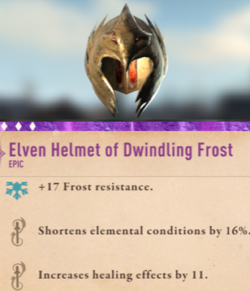
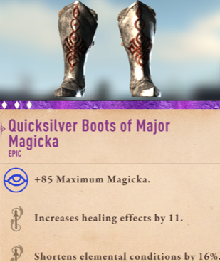
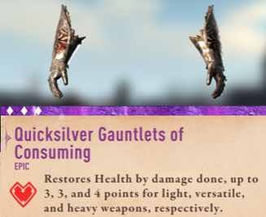
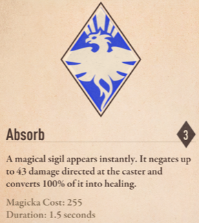

I have continued to play Elder Scrolls: Blades, mainly on my iPhone for the past month in bursts. Overall, it is still holding up, although obviously it is not remotely like a full Elder Scrolls PC game. 

I found I had very little trouble through the single digits and into the teen levels. The occasional level had some minor grind spots for difficulty, but nothing too bad. The early 20's levels however, started off pretty rough. Granted, this was in part because around level 19, I chose to re-spec skills towards light weapons and magic. Learning curve with magic converting to it later in the game was a bit harder, so more enemies beat me around.

The real sweet spot from my current play came around level 23-24, when most of this gear combo below came together. 
<!--more-->

It turned out to be an amazing gear set all the way to level 29. The two pieces of gear that received bonus enchantment of extra healing effects were key. With that extra healing, food in missions healed a *lot*. With the third piece being the gauntlets, I was regularly doing 4-5 Skull missions without issues, as long as I kept dealing damage I could out-heal my opponent. 

Finally, I generally combined that with the basic *Absorb* spell:

Which would cover the minor gaps in healing occasionally needed if I had a round of good blocks from the enemy killing my combo or damage output. The rest of the fighting was mostly combo damage with a weapon matched to the opponent, and the occasional spell with the right damage type.

As I continue playing, my next grind and really challenging point was when I hit level 29. At twenty-nine, all the sudden the difficulty jumped and I was struggling to out heal the damage a lot of opponents could deal. For the most part I simply had to slow down my pace of fighting and be a bit more defensive then I was being. 

Now, I'm sitting at level 31, and my newest gear that is chewing through opponents has been a *Glass Dagger*, enchanted with the bonus combo damage. Previously all my weapons were elemental damage, but with a fast weapon, that bonus combo damage is laying waste even to enemies resistant to slashing damage!

Beyond that, my town is coming along nicely, my various production buildings are between level five and seven. I'm just starting to work into Glass and Charus gear, and already eyeing beyond it towards Ebony with the level eight smithy. 

I'm curious what the long term future of the game will be, if the Arena will turn it into an aggressive pay-to-win formula, or if they'll be able to add more exploration and story element so that the end-game is not just Arena matches. 
