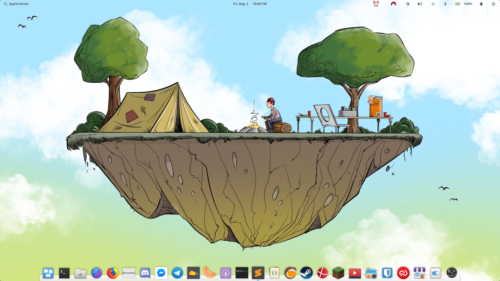
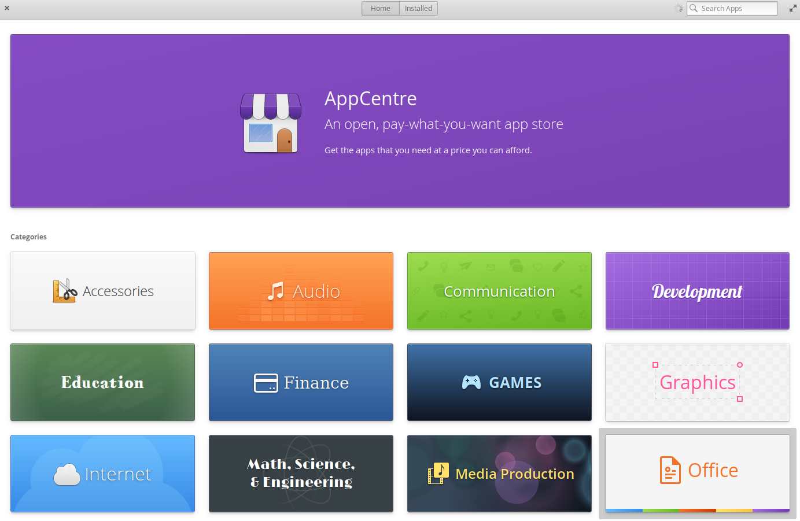
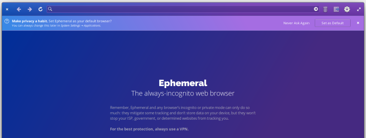
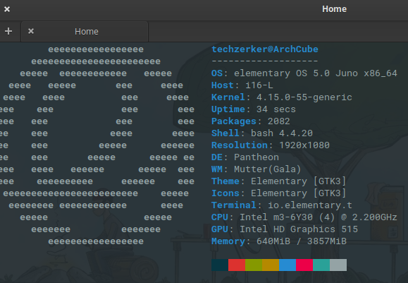
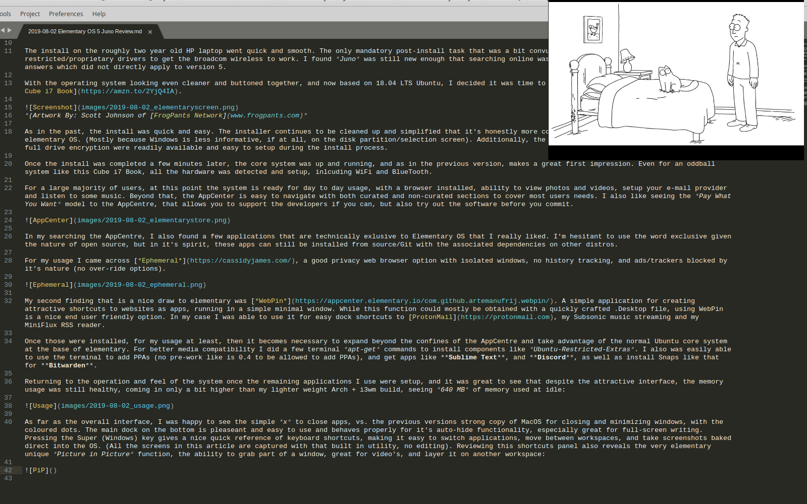

When I first really transitioned into the Linux world from Windows, I started with Ubuntu. That is a very common introductory point for many, or was, and from there I was an aggressive distro-hopper. I shifted through the Kubuntu's and Xubuntu's of the day, into ArchLabs on one laptop. At some point about two years ago took a stop at [*elementary OS*](https://elementary.io) in it's 0.4 version (just one version before 5, they dropped the decimals).

<!--more-->
When I first ran elementary OS 0.4, I liked the style and cohesive design. Compared to some of the distros I had tried it took some of that raw linux feel away, as far as what a normal end user might experience. Overall, I liked it and was going to install it on my main system. The full stop point I hit was the distro was based on Ubuntu 16.04 LTS. The kicker with that was the system I was using was UEFI only, and the linux kernel for 16.04 LTS did not yet natively support UEFI, nor had I discovered tools like [ReFind](https://www.rodsbooks.com/refind/). As such, I continued on hopping until falling into my current Arch Linux and i3wm realm, which I'll talk on seperatly.

Forward to this past week, and I was sorting our a personal laptop for a co-worker that was collecting dust with a very disliked Windows 10 install. As a very non-tech user, I convinved him I could make the system run way better, and for his mostly browser based usage, be easier to use as well. My target was the clean looking elementary OS. 

The install on the roughly two year old HP laptop went quick and smooth. The only mandatory post-install task that was a bit convuluted was getting to an option to enable restricted/proprietary drivers to get the broadcom wireless to work. I found *Juno* was still new enough that searching online was giving a fair volume of 0.3 and 0.4 version answers which did not directly apply to version 5. 

With the operating system looking even cleaner and buttoned together, and now based on 18.04 LTS Ubuntu, I decided it was time to give it a try on my little travel laptop, my [Cube i7 Book](https://amzn.to/2YjQ4IA).

*(Artwork By: Scott Johnson of [FrogPants Network](http://www.frogpants.com)*

As in the past, the install was quick and easy. The installer continues to be cleaned up and simplified that it's honestly more confusing to fresh install Windows 10 than elementary OS. (Mostly because Windows is less informative, if at all, on the disk partition/selection screen). Additionally, the options which I took advantage of to have full drive encryption were readily available and easy to setup during the install process. 

Once the install was completed a few minutes later, the core system was up and running, and as in the previous version, makes a great first impression. Even for an oddball system like this Cube i7 Book, all the hardware was detected and setup, inlcuding WiFi and BlueTooth.

For a large majority of users, at this point the system is ready for day to day usage, with a browser installed, ability to view photos and videos, setup your e-mail provider and listen to some music. Beyond that, the AppCenter is easy to navigate with both curated and non-curated sections to cover most users needs. I also like seeing the *Pay What You Want* model to the AppCentre, that allows you to support the developers if you can, but also try out the software before you commit.  

In my searching the AppCentre, I also found a few applications that are technically exlusive to Elementary OS that I really liked. I'm hesitant to use the word exclusive given the nature of open source, but in it's spirit, these apps can still be installed from source/Git with the associated dependencies on other distros. 

For my usage I came across [*Ephemeral*](https://cassidyjames.com/), a good privacy web browser option with isolated windows, no history tracking, and ads/trackers blocked by it's nature (no over-ride options). 

My second finding that is a nice draw to elementary was [*WebPin*](https://appcenter.elementary.io/com.github.artemanufrij.webpin/). A simple application for creating attractive shortcuts to websites as apps, running in a simple minimal window. While this function could mostly be obtained with a quickly crafted .Desktop file, using WebPin is a nice end user friendly option. In my case I was able to use it for easy dock shortcuts to [ProtonMail](https://protonmail.com), my Subsonic music streaming and my MiniFlux RSS reader.

Once those were installed, for my usage at least, then it becomes necessary to expand beyond the confines of the AppCentre and take advantage of the normal Ubuntu core system at the base of elementary. For better media compatibility I did a few terminal *apt-get* commands to install components like *Ubuntu-Restricted-Extras*. I also was easily able to use the terminal to add PPAs (no pre-work like is 0.4 to be allowed to add PPAs), and get apps like **Sublime Text**, and **Discord**, as well as install Snaps like that for **Bitwarden**.  

Returning to the operation and feel of the system once the remaining applications I use were setup, and it was great to see that despite the attractive interface, the memory usage was still healthy, coming in only a bit higher than my lighter weight Arch + i3wm build, seeing *640 MB* of memory used at idle:

As far as the overall interface, I was happy to see the simple *x* to close apps, vs. the previous versions strong copy of MacOS for closing and minimizing windows, with the coloured dots. The main dock on the bottom is pleaseant and easy to use and behaves properly for it's auto-hide functionality, especially great for full-screen writing. Pressing the Super (Windows) key gives a nice quick reference of keyboard shortcuts, making it easy to switch applications, move between workspaces, and take screenshots baked direct into the OS. (All the screens in this article are captured with that built in utility, no editing). Reviewing this shortcuts panel also reveals the very elementary unique *Picture in Picture* function, the ability to grab part of a window, great for video's, and layer it on another workspace:

The Picture in Picture option is a very neat and useful feature I have not seen in any other operating system as a baked in option, and yet is a simple keyboard shortcut to operate. It's evidence of elementary in my opinion doing an excellent job bringing a very end user friendly approach and consistent look and feel to Linux. 

*Do you sacrifice the extreme customizability that Linux is capable of?* 

> Yeah, at least to some extent, but if your in that camp like my current main system is, your an advanced user and can make your own educated decision. 

*Is elementary just for 'regular end users' and new users?* 

> Absolutly not, any advaned user can at minimum appreciate the volume of effort put in place to present a very cohesive and professional looking operating system. It's a system that is very easy to show both to basic end users and technical users that doubt linux or hold on to old statements or myths about linux, and show what it can be and is today. 

Finally, *how will I be using elementary OS after this review and setup?*

> Without a doubt I'm really liking what I'm seeing with a mature elementary OS, the install I'm writing on right now on my Cube i7 Book is staying with elementary, and I'll be circling back to several of the apps I downloaded free and using the *Pay What You Want* to pitch in to a few developers. Regarding my main Republic of Gamers laptop...I'm still undecided. I'll detail my setup in another post, but that system is doing all my heavy work and all my gaming with an Arch Linux build and i3 window manager, meaning it's very customized. I really enjoy i3 and the rolling release model of Arch, but it's also hard to turn down the out of the box polish of elementary OS. 

Needless to say, elementary is a very easy pick to install or show off if your trying to bring over any windows users to a smoother, more secure and stable system. I'm at a loss to suggest anything other than elementary for converting skeptics to linux, even avid PC gamers like myself. 