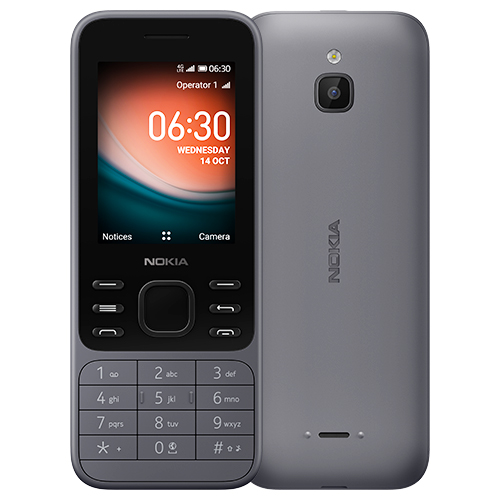

After having read [Digital Minimalism]() in 2019, I have implemented the concepts in various forms.

Firstly, and the one that has had the most effective impact and balance, was handling notifications on devices. This included all forms of audio and visual push notifications, and the notification counters on app icons. 
<!--more-->
In late 2019 I took a drastic approach and migrated my phone number to [Ooma]() VoIP service, which with their premium service included an app that supported all calling features, incoming and outgoing. I paired this with ordering a basic ZTE 8” Android tablet with LTE as my “semi-portable” phone. This setup worked, with minor inconvenience in a few scenarios. I stuck with it for roughly eight months as a great way to not have a pocketable phone with me at all.

I enjoy testing these boundaries to better reflect on modern technology. To that end, after researching options, I have settled on ordering a *Nokia 6300 4G*, a KaiOS feature phone device that is compatible with Canadian networks.

HMD Global, the company behind the Nokia name these days has produced a wide variety of hardware. They’ve created a range of mid-range and high end Android devices, and a handful of classic inspired *feature phones*. 

