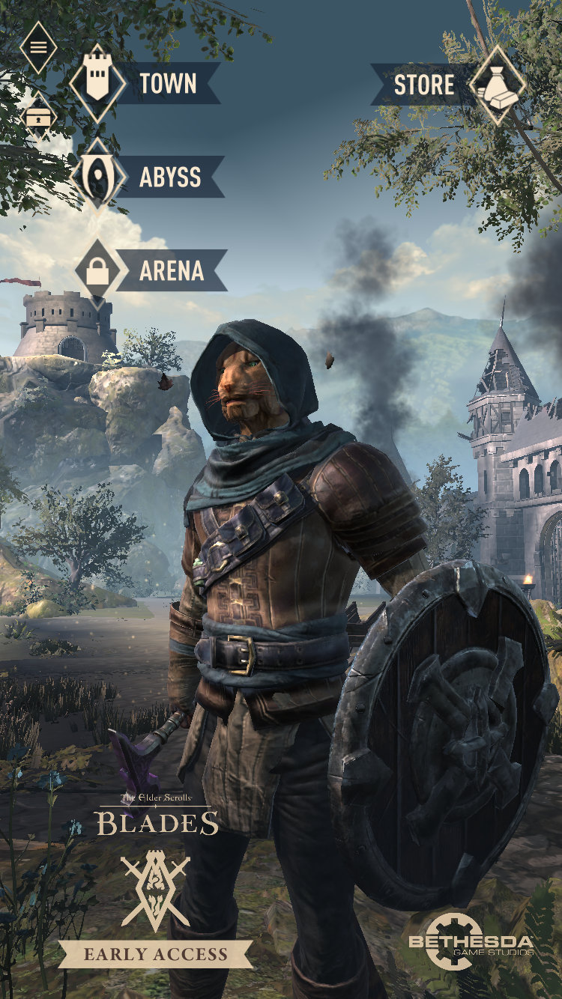
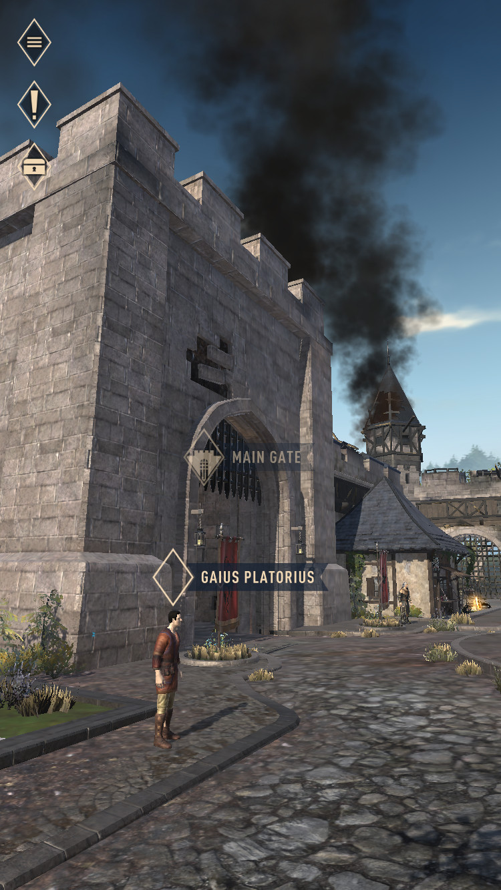
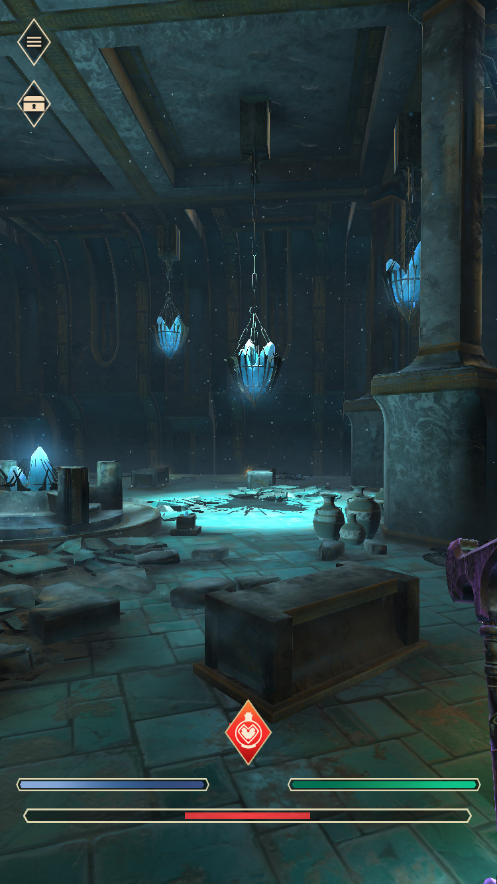

# Elder Scrolls: Blades - Early Access

As many will have seen, the originally announced last year mobile *Elder Scrolls* game has finally landed! Granted, they've labelled it as *Early Access* and are slowly rolling out invites to iOS and Android Users. That being said, I was invited a little over forty-eight hours ago.

### In Brief

It's really good. It looks absolutely gorgeous on my iPhone 8, and only slightly less so on my older iPad Air 2. Character design is more flexible than most mobile games, and starting out, it does actually have a story. Unfortunately, it is *Free to Play* model, but it feels fine. It's definitely worth a try for Elder Scrolls on the go!
<!--more-->
### Game-play

The controls are perfect! It's better by a long shot in portrait mode, where it's all one hand, one finger really, playable. The excellent execution of the controls really helps make the game. 

Free roaming around your own town is vivid and alive, and your going to be rebuilding it to your style. The story is off to a good start, I expect they will keep fleshing it out as the game leaves *Early Access*. Outside of the story there are always quick quests to do to find better gear and resources for your town. It's not full world free-roaming like a full PC Elder Scrolls game, but it's also not static menu's or walk-on-rails. 

### Visuals

Nothing to say, it looks better than I expected, so here is a trio of shots that are at least Oblivion level, I think HD Oblivion texture level, at least on iPhone 8.

### What I Want Next?

- More Quest Text: Flesh out major story, and add more story to minor/job quests. Bethesda's writers are well known, so I expect they'll apply this as the game expands.

- Additional Free Roam: I like what it has now, as the game grows I expect they'll add more options to customize the town further, and I would like to maybe have a small area outside the town walls to free roam. I think this is likely if the game does well for Bethesda.

### What I Dislike?

- Unfortunately, it is a "Free to Play" model, but it's not too invasive. I have not seen any dreaded advertisements or "watch ads to do **X** faster" options, so kudo's to that decision. I will likely do some small purchases to support Bethesda, as the F2P has not been in my face or prompting in any way. 

---

There you have it, I think Elder Scrolls: Blades is off to a good start with the *Early Access* tag. It has some good potential, looks great, didn't murder my battery life and the Free to Play model is not invasive at all and has no advertisements. 

---

